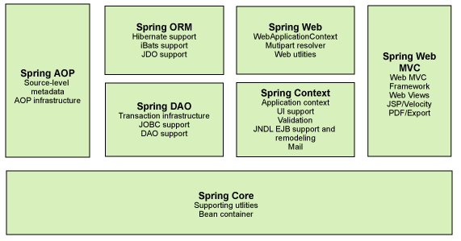
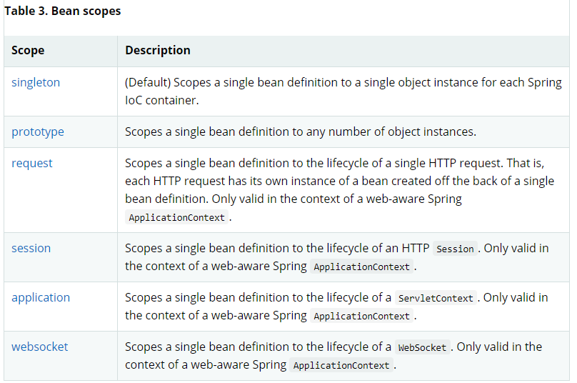
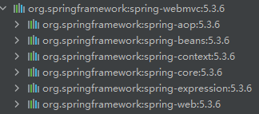
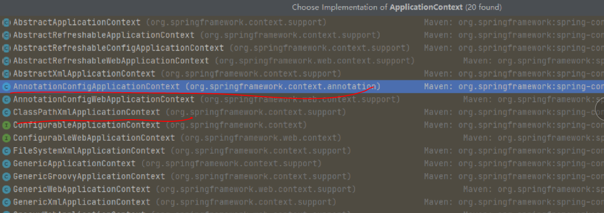
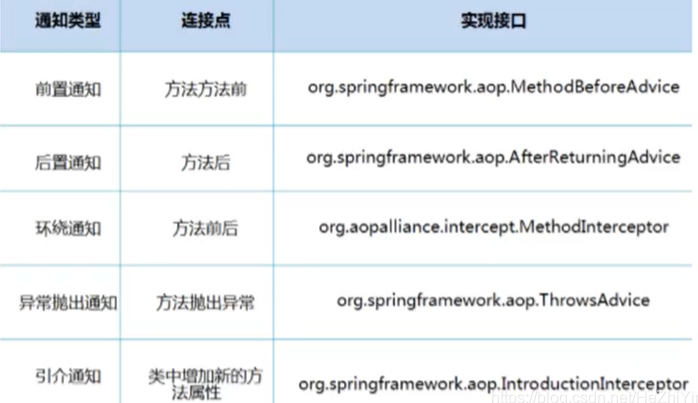

# 1、Spring

## 1.1 简介

- 2002年，首次推出了Spring框架的雏形，Interface21框架
- 2004年，Spring以interface框架为基础，于2004年3月24日发布了1.0版本
- Rod Johnson “不要重复造轮子”
- Spring理念：使现有技术更加容易使用，本身是一个大杂烩，整合现有技术框架

SSH：Struts + Spring + Hibernate

SSM：SpringMvc + Spring + Mybatis


官网：https://docs.spring.io/spring-framework/docs/current/reference/html/overview.html#overview

github：https://github.com/spring-projects/spring-framework


Maven：

Spring Web MVC

```xml
<dependency>
    <groupId>org.springframework</groupId>
    <artifactId>spring-webmvc</artifactId>
    <version>5.3.6</version>
</dependency>
```

Spring JDBC

```xml
<dependency>
    <groupId>org.springframework</groupId>
    <artifactId>spring-jdbc</artifactId>
    <version>5.3.6</version>
</dependency>
```


## 1.2 优点

- Spring是一个开源的免费的框架（容器）！
- Spring是一个轻量级，非入侵式的框架！
- 控制反转（IOC），面向切面编程（AOP）！
- 支持事务的处理，对框架整合的支持！


一句话：Spring是一个轻量级的控制反转（IOC），面向切面编程（AOP）框架！


## 1.3 组成




## 1.4 拓展

构建--->协调--->连接

现代化的java开发是基于Spring的开发！


Spring Boot ：

- 一个快速开发的脚手架
- 基于Spring Boot可以快速开发单个微服务
- 约定大于配置

Spring Cloud

- Spring Cloud基于Spring Boot实现的

现在大多数公司都在使用SpringBoot进行快速开发，学习SpringBoot的前提，需要完全掌握Spring及SpringMVC！

弊端：发展太久，配置十分繁琐，“配置地狱”


# 2、IOC理论推导

1. UerDao接口

2. UserDaoImpl实现类

3. UserService业务接口
4. UserService业务实现类


在之前的业务中，客户的需求可能会影响原来的代码，需要根据用户的需求去修改原代码！

使用一个Set方法

```java
//利用set实现动态值的注入！
public void setUserDao(UserDao userDao) {
    this.userDao = userDao;
}
```

- 之前，程序是主动创建对象，控制权在程序员手上
- 使用Set注入后，程序不再具有主动性，而是变成了被动的接受对象！

这种思想，从本质上解决了问题，程序员不用再去管理对象的创建，系统耦合度大大降低，可以更加专注的在业务实现上。这是IOC的原型！

## IOC本质

**控制反转IoC（Inversion of Control），是一种设计思想，DI（依赖注入）是IoC的一种方法**。没有IoC的程序中，我们使用面向对象编程，对象的创建于对象间的依赖关系完全硬编码在程序中，对象的创建由程序自己控制，控制反转后将对象的创建转移给第三方。

IoC是Spring核心内容。Spring容器在初始化时先读取配置文件，根据配置文件或元数据创建与组织对象存入容器中，程序使用时再从IoC容器中取出必要的对象。


采用XML方式配置Bean的时候，Bean的定义信息和实现分离的，而采用注解的方式可以把两者合为一体，bean的定义信息直接以注解的形式定义在实现类中，从而达到零配置的目的。


**控制反转是一种通过描述（XML或注解）并通过第三方去生产或获取特定对象的方式。在Spring中实现控制反转的是IoC容器，其实现方式是依赖注入（Dependency Injection，DI）**


# 3、HelloSpring

1. 定义Hello

   ```java
   public class Hello {
       private String name;
   
       public String getName() {
           return name;
       }
   
       public void setName(String name) {
           this.name = name;
       }
   
       public void show() {
           System.out.println("Hello " + name);
       }
   }
   ```

2. 编写beans.xml

   ```xml
   <?xml version="1.0" encoding="UTF-8"?>
   <beans xmlns="http://www.springframework.org/schema/beans"
          xmlns:xsi="http://www.w3.org/2001/XMLSchema-instance"
          xsi:schemaLocation="http://www.springframework.org/schema/beans
           https://www.springframework.org/schema/beans/spring-beans.xsd">
   <!--    使用Spring来创建对象，在Spring中 这些称为Bean
           bean 对象     new Hello()
           class  为 new 的对象
           property 相当于给对象中的属性设置一个值
           -->
       <bean id="hello" class="com.zpc.pojo.Hello">
           <property name="name" value="Spring" />
       </bean>
   </beans>
   ```

3. 测试

   ```java
   import org.junit.Test;
   import org.springframework.context.support.ClassPathXmlApplicationContext;
   
   public class MyTest {
       @Test
       public void test() {
           // 获取Spring的上下文对象
           ApplicationContext context = new ClassPathXmlApplicationContext("beans.xml");
   
           //我们的对象都在Spring中管理了， 我们要使用， 直接去里面取就可以了
           Hello hello = (Hello)context.getBean("hello");
   
           hello.show();
       }
   }
   ```

   

hello 对象是由Spring创建的

hello对象的属性是由Spring容器设置的


这个过程叫做控制反转：

控制：谁来控制对象的创建，传统应用程序的对象都是由程序本身控制创建的，使用Spring后，对象是由Spring来创建的，

反转：程序本身不创建对象，而变成被动的接受对象

依赖注入：就是利用set方法来进行注入的

可以用过new ClassPathXmlApplicationContext去浏览一下底层代码

**到现在，可以彻底不用程序中取改动了，要实现不同的操作，只需要xml配置文件中进行修改，所谓的IoC就是：对象由Spring来创建，管理，装配！**


# 4、IOC创建对象的方式

1. 使用无参构造创建

2. 假设我们使用有参构造创造对象

   1. 下标赋值

   ```xml
   <!--    第一种 下标赋值-->
       <bean id="user" class="com.zpc.pojo.User">
           <constructor-arg index="0" value="Spring"/>
       </bean>
   ```

   2. 参数类型 （不建议）

   ```xml
   <bean id="user" class="com.zpc.pojo.User">
       <constructor-arg type="java.lang.String" value="Spring"/>
   </bean>
   ```

   3. 直接通过参数名来构造

   ```xml
   <!--直接通过参数名-->
   <bean id="user" class="com.zpc.pojo.User">
       <constructor-arg name="name" value="Spring"/>
   </bean>
   ```


总结：在配置文件加载的时候，容器中管理的对象就已经初始化了！


# 5、Spring配置

## 5.1 别名

```xml
<alias name="user" alias="userNew"/>
```

```java
User user1 = (User)context.getBean("userNew");
```

可以使用别名加载对象

## 5.2 配置

```xml
<!--        id: bean的唯一标识符-->
<!--        class：bean对象对应的全限定名：包名+类型-->
<!--        name：也是别名 用name也可取别名, 可以同时取多个别名-->
<bean id="userT" class="com.zpc.pojo.UserT" name="userT2, u2">

</bean>
```

## 5.3 import

这个import，一般用于团队开发，可以使多个配置文件，导入合并成一个

假设项目有多个人开发，不同人开发 不同bean，我们可以利用import不同的beans.xml合并成一个

使用的时候，直接用总的配置就可以了。

applicationContext.xml

```xml
<?xml version="1.0" encoding="UTF-8"?>
<beans xmlns="http://www.springframework.org/schema/beans"
       xmlns:xsi="http://www.w3.org/2001/XMLSchema-instance"
       xsi:schemaLocation="http://www.springframework.org/schema/beans
        https://www.springframework.org/schema/beans/spring-beans.xsd">
    
    <import resource="beans.xml"/>
    <import resource="beans1.xml"/>

</beans>
```


# 6、DI依赖注入

## 6.1 构造器注入


## 6.2 Set注入

- 依赖注入：set注入！

  - 依赖：Bean对象的创建依赖于容器

  - 注入：Bean对象中所有属性，由容器来注入


【环境搭建】

1. 复杂类型

```java
public class Address {
    private String address;

    public String getAddress() {
        return address;
    }

    public void setAddress(String address) {
        this.address = address;
    }
}
```

2. 真实测试对象

```java
public class Student {
    private String name;
    private Address address;
    private String[] books;
    private List<String> hobbys;
    private Map<String,String> cards;
    private Set<String> games;
    private Properties info;
    private String wife;
}
```

3. beans.xml

```xml
<?xml version="1.0" encoding="UTF-8"?>
<beans xmlns="http://www.springframework.org/schema/beans"
       xmlns:xsi="http://www.w3.org/2001/XMLSchema-instance"
       xsi:schemaLocation="http://www.springframework.org/schema/beans
        https://www.springframework.org/schema/beans/spring-beans.xsd">
    <bean id="student" class="com.zpc.pojo.Student">
<!--        第一种：普通值注入，value-->
        <property name="name" value="zpc"/>

<!--        第二种 bean注入吗用ref-->
        <property name="address" ref="address"/>

<!--        数组-->
        <property name="books">
            <array>
                <value>红楼梦</value>
                <value>西游记</value>
                <value>水浒传</value>
                <value>三国演义</value>
            </array>
        </property>

<!--        list-->
        <property name="hobbys">
            <list>
                <value>听歌</value>
                <value>打球</value>
            </list>
        </property>

<!--        Map-->
        <property name="cards">
            <map>
                <entry key="身份证" value="321002"/>
                <entry key="驾驶证" value="321002"/>
            </map>
        </property>

<!--        set-->
        <property name="games">
            <set>
                <value>lol</value>
                <value>wow</value>
            </set>
        </property>

<!--        null-->
        <property name="wife">
            <null/>
        </property>

<!--        Properties-->
        <property name="info">
            <props>
                <prop key="学号">12345</prop>
                <prop key="性别">男</prop>
                <prop key="name">zpc</prop>
            </props>
        </property>
    </bean>

    <bean id="address" class="com.zpc.pojo.Address">
        <property name="address" value="南京"/>
    </bean>
</beans>
```


## 6.3 拓展方式注入

我们可以使用p命名空间和c命名空间注入

```xml
<beans xmlns="http://www.springframework.org/schema/beans"
       xmlns:xsi="http://www.w3.org/2001/XMLSchema-instance"
       xmlns:p="http://www.springframework.org/schema/p"
       xmlns:c="http://www.springframework.org/schema/c"
       xsi:schemaLocation="http://www.springframework.org/schema/beans
        https://www.springframework.org/schema/beans/spring-beans.xsd">
<!--    p命名空间注入 property-->
    <bean id="user" class="com.zpc.pojo.User" p:name="zpc" p:age="23"/>

<!--    c命名空间注入， 通过构造器注入 constructor-->
    <bean id="user2" class="com.zpc.pojo.User" c:name="zpc" c:age="23"/>
</beans>
```

测试

```java
@Test
public void Test2() {
    ApplicationContext context = new ClassPathXmlApplicationContext("userBeans.xml");
    User user = context.getBean("user2", User.class);
    System.out.println(user);
}
```

注意点：

p命名空间和c命名空间注入不能直接使用，需要导入xml约束

```xml
xmlns:p="http://www.springframework.org/schema/p"
xmlns:c="http://www.springframework.org/schema/c"
```

**c命名空间需要有有参和无参构造器！！！**


## 6.4 Bean的作用域



1. 单例模式（Spring默认模式）

```xml
<bean id="user2" class="com.zpc.pojo.User" c:name="zpc" c:age="23" scope="singleton"/>
```

2. 原型模式

```xml
<bean id="user2" class="com.zpc.pojo.User" c:name="zpc" c:age="23" scope="prototype"/>
```

```java
@Test
public void Test2() {
    ApplicationContext context = new ClassPathXmlApplicationContext("userBeans.xml");
    User user1 = context.getBean("user2", User.class);
    User user2 = context.getBean("user2", User.class);
    System.out.println(user1 == user2);      // false 
}
```

每次从容器中get的时候，都会产生一个新对象

3. 其余的request session application 这些在web中使用！


# 7、Bean的自动装配

- 自动装配是Spring满足依赖bean依赖的一种方式
- Spring会在上下文中自动寻找，并自动给bean装配


在Spring中有三种装配方式

1. 在xml中显式的配置
2. 在java中显式的配置
3. 隐式的自动装配Bean（重要！！）


## 7.1 测试

环境搭建：一个人有两个宠物


## 7.2 byName 自动装配

```xml
<bean id="cat" class="com.zpc.pojo.Cat"/>

<bean id="dog" class="com.zpc.pojo.Dog"/>
<!--byname: 会自动在容器上下文中查找，和自己对象set方法后面的值对应的beanid！-->
<bean id="person" class="com.zpc.pojo.Person" autowire="byName">

    <property name="name" value="zpc"/>
</bean>
```


## 7.3 byType 自动装配

但是只能保证类型全局唯一的时候才可以用

```xml
<bean id="cat" class="com.zpc.pojo.Cat"/>

<bean id="dog1111" class="com.zpc.pojo.Dog"/>
<!--byname: 会自动在容器上下文中查找，和自己对象属性相同的对应的beanid！-->
<bean id="person" class="com.zpc.pojo.Person" autowire="byType">

<property name="name" value="zpc"/>
</bean>
```

小结：

- byName的时候，保证所有bean的id唯一，并且这个bean需要和自动注入的属性的set方法的值一致
- byType的时候，需要保证bean的class唯一，并且这个bean需要和自动注入的属性的类型一致


## 7.4 使用注解自动装配

jdk1.5支持的注解，Spring2.5就支持注解了

The introduction of annotation-based configuration raised the question of whether this approach is “better” than XML. The short answer is “it depends.”


要使用注解须知：

- 导入约束  context 约束
- 配置注解支持   <<context:annotation-config/>>！！！

```xml
<?xml version="1.0" encoding="UTF-8"?>
<beans xmlns="http://www.springframework.org/schema/beans"
    xmlns:xsi="http://www.w3.org/2001/XMLSchema-instance"
    xmlns:context="http://www.springframework.org/schema/context"
    xsi:schemaLocation="http://www.springframework.org/schema/beans
        https://www.springframework.org/schema/beans/spring-beans.xsd
        http://www.springframework.org/schema/context
        https://www.springframework.org/schema/context/spring-context.xsd">

    <context:annotation-config/>

</beans>
```


@Autowaired

直接在属性上使用即可！也可以在set方法上使用

使用Autowired可以不用编写Set方法，前提是这个自动装配的属性在IoC（Spring)容器中存在，和byType一样

科普：

```xml
@Nullable           字段标记了这个注解，说明这个字段可以为null
```

```java
public @interface Autowired {
    boolean required() default true;
}
```

```java
//    如果显式的定义了required属性为FALSE，说明这个对象可以为null，否则不可以为空
    @Autowired(required = false)
    private Cat cat;

    @Autowired
    private Dog dog;
```


如果@Autowaired自动装配的环境比较复杂，自动装配无法通过一个注解@Autowaired完成时，可以通过@Qualifier(value="xxx")去配合@Autowaired的使用，指定唯一的bean对象的注入。

```java
public class Person {

    @Autowired()
    @Qualifier(value = "cat1")
    private Cat cat;

    @Autowired
    @Qualifier(value = "dog2")
    private Dog dog;

    private String name;
```

```xml
<bean id="cat1" class="com.zpc.pojo.Cat"/>
<bean id="cat2" class="com.zpc.pojo.Cat"/>
<bean id="cat3" class="com.zpc.pojo.Cat"/>

<bean id="dog1" class="com.zpc.pojo.Dog"/>
<bean id="dog2" class="com.zpc.pojo.Dog"/>
<bean id="dog3" class="com.zpc.pojo.Dog"/>

<bean id="person" class="com.zpc.pojo.Person"/>
```

--------

@Resource

```java
@Resource(name = "cat2")
private Cat cat;

@Resource
private Dog dog;

private String name;
```

也可（不常用）


小结：

@Resource 和  @Autowaired的区别：

- 都是用来自动装配，都可以放在属性字段


# 8、使用注解开发

**在Spring4之后，要使用注解开发，必须要保证AOP的包导入**



**使用注解需要导入context约束，配置注解支持**

```xml
<?xml version="1.0" encoding="UTF-8"?>
<beans xmlns="http://www.springframework.org/schema/beans"
       xmlns:xsi="http://www.w3.org/2001/XMLSchema-instance"
       xmlns:context="http://www.springframework.org/schema/context"
       xsi:schemaLocation="http://www.springframework.org/schema/beans
        https://www.springframework.org/schema/beans/spring-beans.xsd
        http://www.springframework.org/schema/context
        https://www.springframework.org/schema/context/spring-context.xsd">

    <!-- 指定扫描这个包，这个包下的注解就会生效-->
    <context:component-scan base-package="com.zpc"/>
    <context:annotation-config/>

</beans>
```

1. bean

2. 属性如何注入

   ```java
   // 等价于<bean id="user" class="com.zpc.pojo.User"/>
   @Component
   @Scope("prototype")
   public class User {
   
       // 相当于 <property name="name" value="zpc">
   //    @Value("zpc")
       public String name;
   
       @Value("zpc")
       public void setName(String name) {
           this.name = name;
       }
   }
   ```

3. 衍生的注解

   @Component有几个衍生注解，我们在Web开发中，会按照mvc三层框架分层

   - dao   【@Repository】

   - service  【@Service】

   - controller  【@Controller】

4. 自动装配配置

   上一章

5. 作用域

   ```java
   @Component
   @Scope("prototype")
   public class User {
   
       // 相当于 <property name="name" value="zpc">
   //    @Value("zpc")
       public String name;
   
       @Value("zpc")
       public void setName(String name) {
           this.name = name;
       }
   }
   ```

6. 小结

   xml与注解：

   - xml更加万能，适用于任何场合！维护更加简单方便
   - 注解，维护复杂

   xml与注解的最佳实践

   - xml用来管理bean
   - 注解只负责完成属性的注入
   - 必须让注解生效，**必须开启注解支持**

   ```xml
   <!-- 指定扫描这个包，这个包下的注解就会生效-->
   <context:component-scan base-package="com.zpc"/>
   <context:annotation-config/>
   ```


# 9、使用Java的方式配置Spring

完全不使用Spring的xml配置，全权交给Java来做

JavaConfig是Spring的一个子项目，在Spring4之后，他变成了核心工程




实体类

```java
//// 这个注解的意思，说明这个类被Spring注册到了容器中
@Component   // 这个不要好像也行
public class User {
    private String name;

    public String getName() {
        return name;
    }

    @Value("zpc")    // 注入值
    public void setName(String name) {
        this.name = name;
    }

    @Override
    public String toString() {
        return "User{" +
                "name='" + name + '\'' +
                '}';
    }
}
```

配置文件

```java
import org.springframework.context.annotation.Bean;
import org.springframework.context.annotation.ComponentScan;
import org.springframework.context.annotation.Configuration;
import org.springframework.context.annotation.Import;

@Configuration        // 这个也会被Spring容器托管，注册到容器中，因为他被@Component，
                      // @Configuration 代表这是个配置类，，就和之前Beans.xml一样
@ComponentScan("com.zpc.pojo")
@Import(config2.class)
public class Config {

    //注册一个Bean，就相当于写的一个Bean标签
    //这个方法的名字相当于 bean标签的id属性
    //这个方法的返回值，相当于 bean标签的class属性
    @Bean
    public User getUser() {
        return new User();          // 就是返回要注入的bean对象
    }
}
```


```java
public class MyTest {
    @Test
    public void Test() {
        //如果完全使用了配置类方式去做，我们就只能通过AnnotationConfig 上下文来获取容器， 通过配置类的class加载
        AnnotationConfigApplicationContext context = new AnnotationConfigApplicationContext(Config.class);
        User user = context.getBean("getUser", User.class);
        System.out.println(user.hashCode());
    }

}
```

这种纯Java的配置方式，在SpringBoot随处可见！


# 10、代理模式

为什么要学代理模式？因为这是Spring AOP的底层！【Spring AOP 和 SpringMVC】


代理模式分类：

- 静态代理

- 动态代理


## 10.1 静态代理

角色分析：

1. 抽象角色：一般会使用接口和抽象类来解决
2. 真实角色：被代理的角色
3. 代理角色：代理真实角色，代理角色后，我们一般会使用一些附属操作
4. 客户：访问代理对象的人


代码步骤：

1. 接口：

   ```java
   // 租房
   public interface Rent {
       public void rent();
   }
   ```

2. 真实角色

   ```java
   // 房东
   public class Host implements Rent{
       @Override
       public void rent() {
           System.out.println("房东要出租房子");
       }
   }
   ```

3. 代理角色

   ```java
   public class Proxy implements Rent{
       private Host host;
   
       public Proxy() {
   
       }
   
       public Proxy(Host host) {
           this.host = host;
       }
   
       @Override
       public void rent() {
           seeHouse();
           host.rent();
           Contract();
           Fare();
   
       }
   
       public void seeHouse() {
           System.out.println("看房子");
       }
   
       public void Contract() {
           System.out.println("签合同");
       }
   
       public void Fare() {
           System.out.println("收钱");
       }
   }
   ```

4. 客户端访问

   ```java
   public class Client {
       public static void main(String[] args) {
           Host host = new Host();
   
           Proxy proxy = new Proxy(host);
   
           proxy.rent();
       }
   }
   ```


代理模式的好处：

- 是真实角色的操作更加纯粹，不用关注公共的事情
- 公共业务交给代理角色，实现业务分工
- 公共业务发生扩展的时候，方便集中管理

缺点：

- 一个真实角色就会产生一个代理角色；代码量翻倍，开发效率降低


## 10.2 动态代理

- 动态代理和静态代理角色一样

- 动态代理的代理类是动态生成的

- 动态代理可以分为两类：基于接口的动态代理，基于类的动态代理

  ​	基于接口--- JDK的动态代理【我们在这里使用】

  ​	基于类：cglib

  ​	java字节码实现：javasist


需要理解两个类：Proxy：代理，InvocationHandler：调用处理程序


动态代理优势：

- 是真实角色的操作更加纯粹，不用关注公共的事情
- 公共业务交给代理角色，实现业务分工
- 公共业务发生扩展的时候，方便集中管理
- 一个动态代理类代理的是一个接口，一般就是对应的一类业务
- 一个动态代理类可以代理多个类，只要这些类都实现同一个接口


# 11、AOP

## 11.1 什么是AOP

AOP（Aspect Oriented Programming）意为：面向切面编程，通过预编译方式和运行期间动态代理实现程序功能的统一维护的一种技术。AOP是OOP的延续，是软件开发的一个热点，也是Spring的一个重要内容，是函数式编程的一种衍生泛型。利用AOP可以对业务逻辑进行隔离，从而使业务逻辑各部分之间的耦合度降低提高程序的可重复性，同时提高了开发效率


## 11.2AOP在Spring中的作用

**提供声明式事务，允许用户自定义切面**

- 横切关注点：跨越应用程序多个模块的方法或功能。即是，与业务逻辑无关的，但是我们需要关注的部分，就是横切关注点。如日志，缓存，事务等等
- 切面（ASPECT）：横切关注点被模块化的特殊对象。一个类
- 通知（Advice）：切面必须完成的工作。类里面的一个方法
- 目标（Target）：被通知对象
- 代理（Proxy）：向目标对象应用通知之后创建的对象
- 切入点（PointCut）：切面通知执行的”地点“的定义
- 连接点（JointPoint）：与切入点匹配的执行点


SpringAOP中，通过Advice定义横切逻辑，Spring中支持5种类型的Advice：



即，Aop在不改变原有代码的情况下，去增加新的功能：

导包：

```xml
<!-- https://mvnrepository.com/artifact/org.aspectj/aspectjweaver -->
<dependency>
    <groupId>org.aspectj</groupId>
    <artifactId>aspectjweaver</artifactId>
    <version>1.9.6</version>
</dependency>
```

方式一：使用Spring的API接口 【主要是Spring API接口实现】

log java

```java
import org.springframework.aop.MethodBeforeAdvice;

import java.lang.reflect.Method;

public class Log implements MethodBeforeAdvice {

    //method: 要执行的目标对象的方法
    //args：参数
    //o：目标对象
    @Override
    public void before(Method method, Object[] objects, Object o) throws Throwable {
        System.out.println(o.getClass().getName() + method.getName() + "被执行了");
    }
}
```

```java
import org.springframework.aop.AfterReturningAdvice;

import java.lang.reflect.Method;

public class AfterLog implements AfterReturningAdvice{

    // returnValue: 返回值
    @Override
    public void afterReturning(Object returnValue, Method method, Object[] args, Object target) throws Throwable {
        System.out.println("执行了" + method.getName() + "， 返回结果为： " + returnValue);
    }
}
```

applicationContext.xml

```xml
<?xml version="1.0" encoding="UTF-8"?>
<beans xmlns="http://www.springframework.org/schema/beans"
       xmlns:xsi="http://www.w3.org/2001/XMLSchema-instance"
       xmlns:aop="http://www.springframework.org/schema/aop"
       xsi:schemaLocation="http://www.springframework.org/schema/beans
        https://www.springframework.org/schema/beans/spring-beans.xsd
        http://www.springframework.org/schema/aop
        https://www.springframework.org/schema/aop/spring-aop.xsd">

    <bean id="userService" class="com.zpc.service.UserServiceImpl" />

    <bean id="log" class="com.zpc.log.Log" />

    <bean id="afterLog" class="com.zpc.log.AfterLog" />

<!--方式一：使用原生的API-->
    <!--配置AOP 需要导入aop约束-->
    <aop:config>
        <!--切入点: expression:表达式， execution(要执行的位置！)-->
        <aop:pointcut id="pointcut" expression="execution(* com.zpc.service.UserServiceImpl.*(..))"/>

        <!--执行环绕增加-->
        <aop:advisor advice-ref="log" pointcut-ref="pointcut" />
        <aop:advisor advice-ref="afterLog" pointcut-ref="pointcut" />
    </aop:config>
    
</beans>
```

Test 

```java
import org.springframework.aop.AfterReturningAdvice;

import java.lang.reflect.Method;

public class AfterLog implements AfterReturningAdvice{

    // returnValue: 返回值
    @Override
    public void afterReturning(Object returnValue, Method method, Object[] args, Object target) throws Throwable {
        System.out.println("执行了" + method.getName() + "， 返回结果为： " + returnValue);
    }
}
```


方式二：自定义类实现 【主要是切面定义】

```xml
<aop:config>
        <!-- 自定义切面  ref 要引用的类-->
        <aop:aspect ref="diy">
            <!-- 切入点-->
            <aop:pointcut id="point" expression="execution(* com.zpc.service.UserServiceImpl.*(..))"/>
            <!-- 通知 -->
            <aop:before method="before" pointcut-ref="point" />
            <aop:after method="after" pointcut-ref="point" />
        </aop:aspect>
    </aop:config>
```

方式三：使用注解实现

```java
import org.aspectj.lang.ProceedingJoinPoint;
import org.aspectj.lang.annotation.After;
import org.aspectj.lang.annotation.Around;
import org.aspectj.lang.annotation.Aspect;
import org.aspectj.lang.annotation.Before;

@Aspect  // 标注这个类是一个切面
public class AnnotationPointCut {

    @Before("execution(* com.zpc.service.UserServiceImpl.*(..))")
    public void before() {
        System.out.println("------------before-----------------");
    }

    @After("execution(* com.zpc.service.UserServiceImpl.*(..))")
    public void after() {
        System.out.println("-------------after------------------");
    }

    // 在环绕增强中，我们可以给一个参数，代表我们要获取处理切入的点
    @Around("execution(* com.zpc.service.UserServiceImpl.*(..))")
    public void around(ProceedingJoinPoint jp) throws Throwable {
        System.out.println("环绕前");

        System.out.println(jp.getSignature());  // 获得签名
        // 执行方法
        Object proceed = jp.proceed();

        System.out.println("环绕后");
    }

}

```

```xml
<bean id="annotationPointCut" class="com.zpc.diy.AnnotationPointCut" />

<!-- 开启注解支持 JDK(默认) expose-proxy="false"   cglib expose-proxy="true" -->
<aop:aspectj-autoproxy expose-proxy="true"/>
```


# 12、整合Mybatis

步骤：

1. 导入相关jar包  

    Mybatis  

   mysql数据库  

   spring  

   aop织入

   mybatis-spring  

2. 编写配置文件

3. 测试


## 12.1 回忆Mybatis

1. 编写实体类
2. 编写核心配置文件
3. 编写接口
4. 编写Mapper
5. 测试


## 12.2 Mybatis-Spring

1. 编写数据源
2. SqlSessionFactory
3. SqlSessionTemplate
4. 给接口加实现类
5. 将自己写的实现类，注入到Spring中
6. 测试使用即可

具体代码间spring-10-mybatis


# 13、声明式事务

## 13.1 回顾事务

- 把一组业务当做一个业务来做，要么都成功，要么都失败
- 事务在项目中十分重要，涉及到数据的一致性，不能马虎
- 确保完整性和一致性

事务ACID原则：

- 原子性
- 一致性
- 隔离性
- 持久性    事务一旦提交，无论系统发生什么问题，结果都不会被影响，被持久化写到存储器中


## 13.2 spring中的事务管理

- 声明式事务：AOP

- 编程式事务：需要在代码中，进行事务的管理


```xml
<!--配置声明式事务 -->
<bean id="transactionManager" class="org.springframework.jdbc.datasource.DataSourceTransactionManager">
    <property name="dataSource" ref="datasource"/>
</bean>

<!--结合AOP实现事务织入 -->
<!--配置事务通知 -->
<tx:advice id="txAdvice" transaction-manager="transactionManager">
    <!--给哪些方法配置事务 -->
    <!--配置事务的传播特性 -->
    <tx:attributes>
        <tx:method name="add" propagation="REQUIRED"/>
        <tx:method name="delete" propagation="REQUIRED"/>
        <tx:method name="query" read-only="true"/>
        <tx:method name="*" propagation="REQUIRED"/>
    </tx:attributes>
</tx:advice>

<!-- 配置事务切入-->
<aop:config>
    <aop:pointcut id="txPointCut" expression="execution(* com.zpc.dao.*.*(..))"/>
    <aop:advisor advice-ref="txAdvice" pointcut-ref="txPointCut" />
</aop:config>
```


如果不在spring中配置事务，就需要在代码中手动配置